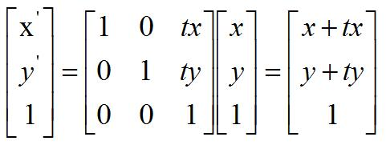
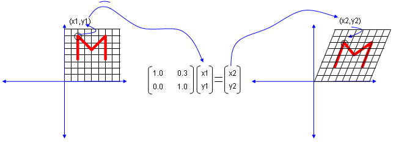
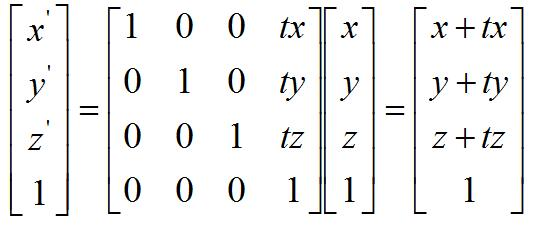
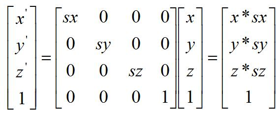
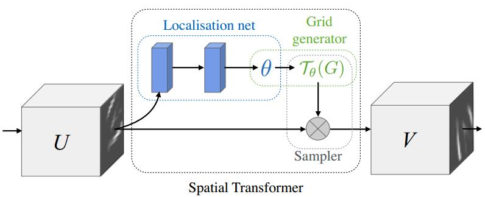
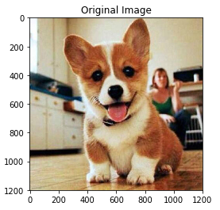
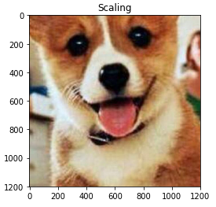
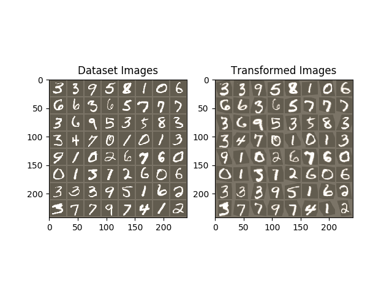
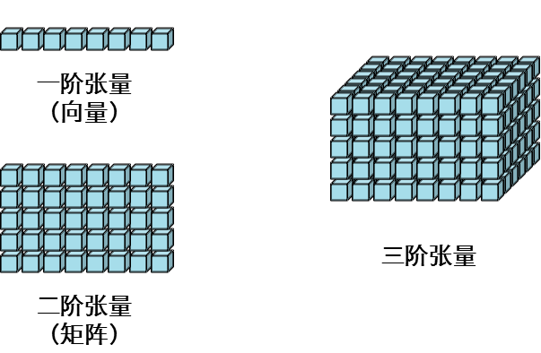

# 矩阵分解

只有**当矩阵的秩为1时**，才可以分解为两个一维向量的乘积。

## 边缘检测

列举两种可以分解为两个一维向量的乘积的矩阵：

| Prewitt边缘检测算子                                  | Sobel边缘检测算子                                    |
| ---------------------------------------------------- | ---------------------------------------------------- |
|  |  |

还有其他的边缘检测算子。

## LU分解

LU分解， 故名思议就是， 把矩阵分成下三角矩阵（Lower）和上三角矩阵（Upper）的一种分解。 所以LU分解只用到了三角矩阵。下三角阵对角元是1，上三角是主元。对于**任意矩阵A**可以写成：


## LDU分解

而从LU分解到LDU分解是很容易做到的，只要把对角线的元素提取出来作为对角矩阵， 然后其他除以对角线元素进行等比例缩放。还可以写成A=LDU，其中D是对角阵，例如：


## LDL分解

此时的**矩阵A是对称矩阵：**

值得注意的是**A*A^T就是对称矩阵**

| 右边这个L的含义是左边的L的转置                         | A的转置和A是一样的                                     |
| ------------------------------------------------------ | ------------------------------------------------------ |
|  |  |
|  |  |

## QR分解

QR分解和SVD分解就要利用到正交矩阵。 Q是一个正交矩阵， 而R是一个上三角矩阵，前面我们提到单位矩阵也是正交矩阵， 所以正交矩阵可以看成是坐标系的转换。 所以有时候， QR分解也可以表示成如下形式。

| Q是一个正交矩阵， 而R是一个上三角矩阵                  | 正交矩阵可以看成是坐标系的转换。 所以有时候， QR分解也可以表示成如下形式。 |
| ------------------------------------------------------ | ------------------------------------------------------------ |
|  |        |

## SVD分解

SVD分解称为Singular value decomposition奇异值分解， 它是正交矩阵和对角矩阵的乘法分解。

| 它是正交矩阵和对角矩阵的乘法分解                       | 从形式上， SVD可以表示成如下：                         |
| ------------------------------------------------------ | ------------------------------------------------------ |
|  |  |

# 矩阵乘法的几何意义

如果把三角矩阵、对角矩阵 和 正交矩阵称为因子矩阵，因子矩阵的几何含义

## 2D仿射变换（affine）：

### 缩放：对角矩阵


| 乘以一个对角矩阵，好比对每个坐标轴进行缩放        | 正数的乘法： 正数好比在原方向上的缩放， 大于1，表示伸长， 小于1，表示缩小。 |
| ------------------------------------------------- | ------------------------------------------------------------ |
|  |             |
|  |             |
### 三角矩阵：平移



上三角矩阵： 上三角矩阵的作用好比进行右上的切变， **水平的斜拉**



### 旋转：正交矩阵

可以看一下正交矩阵的作用， 我们找可以利用一个正交矩阵， 找到对应乘法后的点的变化。


我们可以看到正交矩阵， 并不改变物体的形状， 但是进行了旋转。

## 3D透视变换（projection）

| 平移                                       | 缩放                                       | 旋转                                       |
| ------------------------------------------ | ------------------------------------------ | ------------------------------------------ |
|  |  |  |


## 矩阵分解的几何意义

| 综上所述， 矩阵因子的作用就是要把缩放， 切边， 和旋转分解出来理解一个矩阵的作用。 | 在这种情况下，矩阵乘法的分解就是连续进行几次变化的综合！ |
| ------------------------------------------------------------ | -------------------------------------------------------- |
|             |         |

> 需要注意的是以上只是对点的**位置变化进行了相应的分析**，而对于实际的图像操作还需要别外的分析。

## 优势

我们知道LU/LDU/LL/LDL分解和QR/SVD分解里面， 都有三角阵部分。 那么三角阵到底有什么优势呢？

LU分解的意义

LU分解使得矩阵AX=b的求解分成了LU两部分。


| 而三角矩阵的好处是可以很容易进行连续代入求解！               | 然后再进行上三角矩阵的求解。                           |
| ------------------------------------------------------------ | ------------------------------------------------------ |
|  |  |

三角阵进行方程求解的优势。

## 在STN网络中的使用

出自论文：[Spatial Transformer Networks](https://arxiv.org/pdf/1506.02025.pdf)

项目代码：https://github.com/kevinzakka/spatial-transformer-network

https://pytorch.apachecn.org/docs/0.3/spatial_transformer_tutorial.html

### STN网络的框架图：



> **STN网络**由以下三部分组成:
>
> 1. Localisation Network 
> 2. Grid generator
> 3. Sampler

### Localisation Network ：

该网络就是一个简单的回归网络。将输入的图片进行几个卷积操作，然后**全连接回归出6个角度值**（假设是仿射变换），2*3的矩阵：

```python
#执行一个正常的卷积操作
self.localization = nn.Sequential(
            nn.Conv2d(1, 8, kernel_size=7),
            nn.MaxPool2d(2, stride=2),
            nn.ReLU(True),
            nn.Conv2d(8, 10, kernel_size=5),
            nn.MaxPool2d(2, stride=2),
            nn.ReLU(True)
        )

# Regressor for the 3 * 2 affine matrix
# 产生仿射矩阵theta
self.fc_loc = nn.Sequential(
    nn.Linear(10 * 3 * 3, 10),
    nn.ReLU(True),
    nn.Linear(10, 3 * 2)
)
```

```python
#利用上面定义的两个函数生成theta
xs = self.localization(x)
#print('xs.size():',xs.size())#xs.size(): torch.Size([64, 10, 3, 3])
xs = xs.view(-1, 10 * 3 * 3)
theta = self.fc_loc(xs)
theta = theta.view(-1, 2, 3)
```

### Grid generator：

网格生成器负责将**V中的坐标位置，通过矩阵运算，计算出目标图V中的每个位置对应原图U中的坐标位置**。即生成T(G)。


这里的Grid采样过程，对于**二维仿射变换（旋转，平移，缩放）来说，就是简单的矩阵运算**。

上式中，s代表原始图的坐标，t代表目标图的坐标。A为Localisation Network网络回归出的6个角度值。

>整个Grid生成过程就是：
>
>1. 首先你需要想象上图中V-FeatureMap中全是白色或者全是黑色，是**没有像素信息的**。也就是说V-FeatureMap还不存在，有的只是V-FeatureMap的坐标位置信息。
>2. 然后将目标图V-FeatureMap中的比如（0，0）（0，1）......位置的坐标，与2*3变换矩阵运算。就**会生成出在原始图中对应的坐标信息**，比如（5，0）（5，1）......。这样所有的目标图的坐标都经过这样的运算就会将每个坐标都产生一个与之对应的原图的坐标，**即T(G)**。
>3. 最后通过T(G)和原始图U-FeatureMap的像素，将**原始图中的像素复制到V-FeatureMap中**，从而生成目标图的像素。
```python
 grid = F.affine_grid(theta, x.size()) #Grid generator,生成要进行映射的坐标
```

### Sampler：

采样器根据T(G)中的坐标信息，在原始图U中进行采样，将U中的像素复制到目标图V中。

```python
x = F.grid_sample(x, grid) # Sampler: 裁剪feature map
```

> 实际展示：

```python
#原始图片
from torchvision import transforms
from PIL import Image
import matplotlib.pyplot as plt
%matplotlib inline

img_path = "dog.jpg"
image = Image.open(img_path)
img_torch = transforms.ToTensor()(image) #torch.Size([3, 1200, 1200])
plt.imshow(img_torch.numpy().transpose(1,2,0))
plt.title('Original Image')
plt.show()
```

```python
#缩放操作
from torch.nn import functional as F

theta = torch.tensor([
    [0.5, 0  , 0],
    [0  , 0.5, 0]
], dtype=torch.float)
grid = F.affine_grid(theta.unsqueeze(0), img_torch.unsqueeze(0).size()) #坐标映射的位置
'''
affine_grid的输入是仿射矩阵(Nx2x3)和输出Tensor的尺寸(Tensor.Size(NxHxWx2))，N是batch的大小，
输出的是归一化的二维网格。
'''
output = F.grid_sample(img_torch.unsqueeze(0), grid) #进行采样
new_img_torch = output[0]
plt.imshow(new_img_torch.numpy().transpose(1,2,0))
plt.title('Scaling')
plt.show()
```

                   



### 实验

作者分别在MNIST，Street View House Numbers ，CUB-200-2011 birds dataset 这3个数据集上做了实验。

#### MNIST


>从作图可以看出，FCN 错误率为13.2% , CNN 错误率为3.5% , 与之对比的 ST-FCN 错误率为2.0% ，ST-CNN 错误率为 1.7%。可以看出STN的效果还是非常明显的。
>
>- R:rotation (旋转)
>
>- RTS:rotation, scale and translation (旋转，缩放，平移)
>
>- P:projective transformation (投影)
>
>- E:elastic warping (弹性变形)

#### Street View House Numbers实验：


>可以看出不管是64像素还是128像素，ST-CNN比传统的CNN错误率要低一些。

#### CUB-200-2011 birds dataset实验：


>右图红色框检测头部，绿色框检测身体。
>
>这个数据集是属于细粒度分类的一个数据集。好多做细粒度分类的文章都会在该数据集上做实验。从这个实验可以看出，STN可以有attention的效果，可以训练的更加关注ROI区域。
>
>实验结果有0.8个百分点的提升。

# 张量分解

## 张量

| 张量                                       | 矩阵展开(Unfolding-Matricization)                    |
| ------------------------------------------ | ---------------------------------------------------- |
|  |  |

| 纤维：只保留一个维度变化                      | 切片：在张量中抽取矩阵的操作                   |
| --------------------------------------------- | ---------------------------------------------- |
|  |  |


