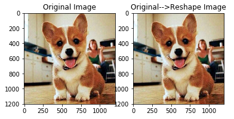
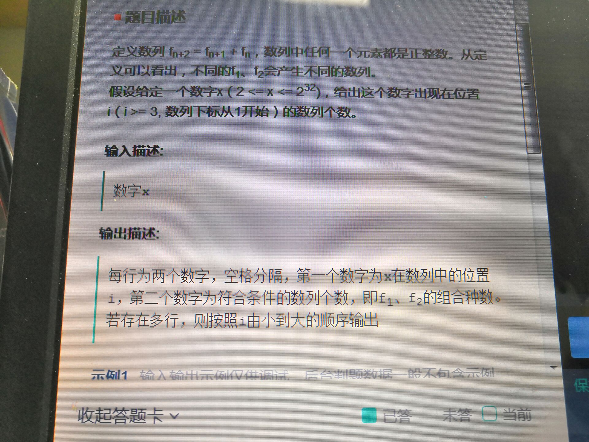
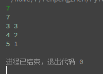
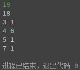

[TOC]

# 绘图


# 读取txt文件中os.walk的使用

```python
import os
for root, dirs, files in os.walk("/home/r/renpengzhen/PyTorch/darts-master/NAS_AR_CNN/core", topdown=False):
    print(root)

#输出目录的路径
/home/r/renpengzhen/PyTorch/darts-master/NAS_AR_CNN/core/__pycache__
/home/r/renpengzhen/PyTorch/darts-master/NAS_AR_CNN/core

import os
for root, dirs, files in os.walk("/home/r/renpengzhen/PyTorch/darts-master/NAS_AR_CNN/core", topdown=False):
    print(dirs)

#root下所有子目录的名字               
[]
['__pycache__']

import os
for root, dirs, files in os.walk("/home/r/renpengzhen/PyTorch/darts-master/NAS_AR_CNN/core", topdown=False):
    print(files)

#包含了所有非目录文件的名字
['architect.cpython-35.pyc', 'utils.cpython-35.pyc', 'config.cpython-35.pyc', 'metrics.cpython-35.pyc', 'const.cpython-35.pyc', 'data_utils.cpython-35.pyc']
['architect.py', 'utils.py', 'metrics.py', 'const.py', 'data_utils.py', 'config.py']
```


# 对shape的操作

```python
import torch
a = torch.tensor([[1,2,3,4,5,6],[7,8,9,10,11,12]])
a.shape
Out[50]: torch.Size([2, 6])
b = a.view(2,2,3)
b
Out[52]: 
tensor([[[ 1,  2,  3],
         [ 4,  5,  6]],
        [[ 7,  8,  9],
         [10, 11, 12]]])
c = b.permute(0,2,1).contiguous()
d = c.view(2,6)
d
Out[58]: 
tensor([[ 1,  4,  2,  5,  3,  6],
        [ 7, 10,  8, 11,  9, 12]])
```


# 文件读取

## 读取.pkl文件

- python3

```python
import pickle as pkl
def pkl_load(path):
    with open(path, 'rb') as f:
        data = pkl.load(f)
    return data
```


# 多线程异步处理

```python
from multiprocessing import Pool
import time
def f(x):
    print(x*x)
if __name__ == '__main__':
    pool = Pool(processes=4)
    pool.map(f, range(10))
    r  = pool.map_async(f, range(10))
    # DO STUFF
    print ('HERE')
    r.wait()
    print ('MORE')
    print ('DONE')

#Out：
0
1
4
9
16
25
36
49
64
81
HERE
0
1
4
9
16
25
36
49
81
64
MORE
DONE
```

> 参考：[[python-2.7 – Python多处理：map vs map_async](https://codeday.me/bug/20180920/256512.html)]

# kill GPU缓存

```shell
r@r-Super-Server:~$ nvidia-smi
Sun Aug 25 10:23:02 2019       
+-----------------------------------------------------------------------------+
| NVIDIA-SMI 430.40       Driver Version: 430.40       CUDA Version: 10.1     |
|-------------------------------+----------------------+----------------------+
| GPU  Name        Persistence-M| Bus-Id        Disp.A | Volatile Uncorr. ECC |
| Fan  Temp  Perf  Pwr:Usage/Cap|         Memory-Usage | GPU-Util  Compute M. |
|===============================+======================+======================|
|   0  GeForce GTX 1070    Off  | 00000000:03:00.0  On |                  N/A |
|ERR!   43C    P8     9W / 250W |   8040MiB /  8111MiB |      0%      Default |
+-------------------------------+----------------------+----------------------+
                                                                               
+-----------------------------------------------------------------------------+
| Processes:                                                       GPU Memory |
|  GPU       PID   Type   Process name                             Usage      |
|=============================================================================|
|    0      1164      G   /usr/lib/xorg/Xorg                            49MiB |
|    0      4242      C   ...anaconda3/envs/pytorch110/bin/python3.5  7979MiB |
+-----------------------------------------------------------------------------+
r@r-Super-Server:~$ kill 4242 pid
-bash: kill: pid: 参数必须是进程或任务 ID
```


# 模型的保存与加载

[Pytorch模型的保存与加载](https://blog.csdn.net/liuweiyuxiang/article/details/82224374)

- 模型加载

  ```python
  i3d = InceptionI3d(400, in_channels=3)
  i3d.load_state_dict(torch.load('models/rgb_imagenet.pt')) #加载rgb模型的参数
  ```

- 使用多GPU

  ```python
  i3d.cuda()
  i3d = nn.DataParallel(i3d)
  ```

  

# 创建张量

创建一个没有初始化的5×3矩阵：

```python
x = torch.empty(5, 3)
```

创建一个随机初始化矩阵：

```python
x = torch.rand(5, 3)
```

一个构造填满`0`御姐数据类型为`long`的矩阵：

```python
x = torch.zeros(5, 3, dtype=torch.long)
```

直接从数据构造张量：

```python
x = torch.tensor([5.5, 3])
```

或者根据已有的张量建立新的张除非用户提供新的值，否则这些方法将重用输入张量的属性，例如D型等。：

```python
x = x.new_ones(5, 3, dtype=torch.double)      # new_* methods take in sizes
print(x)

x = torch.randn_like(x, dtype=torch.float)    # 重载 dtype!
print(x)                                      # 结果size一致
```

## 将torch的Tensor转化为NumPy数组

输入：

```python
a = torch.ones(5)
print(a)
```

输出：

```python
tensor([1., 1., 1., 1., 1.])
```

输入：

```python
b = a.numpy()
print(b)
```

输出：

```python
[1. 1. 1. 1. 1.]
```

## 将NumPy数组转化为Torch张量

看改变NumPy数组是如何自动改变Torch张量的：

```python
import numpy as np
a = np.ones(5)
b = torch.from_numpy(a)
np.add(a, 1, out=a)
print(a)
print(b)
```

输出：

```python
[2. 2. 2. 2. 2.]
tensor([2., 2., 2., 2., 2.], dtype=torch.float64)
```

# Python学习笔记之optparse模块OptionParser

[python argparse用法总结](https://www.cnblogs.com/yymn/p/8056487.html)

## 基础用法

```python
#!/usr/bin/env python
# encoding: utf-8
import argparse
parser = argparse.ArgumentParser()
parser.parse_args()

#测试：
yarving@yarving-VirtualBox /tmp $ python prog.py 
yarving@yarving-VirtualBox /tmp $ python prog.py --help
usage: prog.py [-h]
optional arguments:
  -h, --help  show this help message and exit

yarving@yarving-VirtualBox /tmp $ python prog.py -v 
usage: prog.py [-h]
prog.py: error: unrecognized arguments: -v

yarving@yarving-VirtualBox /tmp $ python prog.py foo
usage: prog.py [-h]
prog.py: error: unrecognized arguments: foo
```

- 第一个没有任何输出和出错
- 第二个测试为打印帮助信息，argparse会自动生成帮助文档
- 第三个测试为**未定义的-v参数，会出错**
- 第四个测试为未定义的参数foo，出错

## positional arguments

positional arguments为英文定义，中文名叫有翻译为定位参数的，用法是不用带-就可用
修改prog.py的内容如下：

```python
#!/usr/bin/env python
# encoding: utf-8
import argparse
parser = argparse.ArgumentParser()
parser.add_argument("echo")
args = parser.parse_args()
print args.echo
```

执行测试如下

```python
yarving@yarving-VirtualBox /tmp $ python prog.py   
usage: prog.py [-h] echo
prog.py: error: too few arguments

yarving@yarving-VirtualBox /tmp $ python prog.py -h
usage: prog.py [-h] echo

positional arguments:
  echo

optional arguments:
  -h, --help  show this help message and exit

yarving@yarving-VirtualBox /tmp $ python prog.py hahahaha
hahahaha
```

定义了一个叫`echo`的参数，默认必选

- 第一个测试为不带参数，由于`echo`参数为空，所以报错，并给出用法（usage）和错误信息
- 第二个测试为打印帮助信息
- 第三个测试为正常用法，回显了输入字符串hahahaha

## optional arguments

中文名叫可选参数，有两种方式：

1. 一种是通过一个`-`来指定的**短参数**，如`-h`；
2. 一种是通过`--`来指定的长参数，如`--help`

这两种方式可以同存，也可以只存在一个，修改prog.py内容如下：

```python
#!/usr/bin/env python
# encoding: utf-8
import argparse
parser = argparse.ArgumentParser()
parser.add_argument("-v", "--verbosity", help="increase output verbosity")
args = parser.parse_args()
if args.verbosity:
        print "verbosity turned on"
```

注意这一行：`parser.add_argument("-v", "--verbosity", help="increase output verbosity")`
定义了可选参数`-v`或`--verbosity`，通过解析后，其值保存在`args.verbosity`变量中
用法如下：

```python
yarving@yarving-VirtualBox /tmp $ python prog.py -v 1
verbosity turned on

yarving@yarving-VirtualBox /tmp $ python prog.py --verbosity 1
verbosity turned on

yarving@yarving-VirtualBox /tmp $ python prog.py -h           
usage: prog.py [-h] [-v VERBOSITY]

optional arguments:
  -h, --help            show this help message and exit
  -v VERBOSITY, --verbosity VERBOSITY
                        increase output verbosity

yarving@yarving-VirtualBox /tmp $ python prog.py -v 
usage: prog.py [-h] [-v VERBOSITY]
prog.py: error: argument -v/--verbosity: expected one argument
```

- 测试1中，通过`-v`来指定参数值
- 测试2中，通过`--verbosity`来指定参数值
- 测试3中，通过`-h`来打印帮助信息
- 测试4中，没有给`-v`指定参数值，所以会报错

## action='store_true'

上一个用法中-v必须指定参数值，否则就会报错，有没有像`-h`那样，不需要指定参数值的呢，答案是有，通过定义参数时指定`action="store_true"`即可，用法如下

```
#!/usr/bin/env python
# encoding: utf-8


import argparse


parser = argparse.ArgumentParser()
parser.add_argument("-v", "--verbose", help="increase output verbosity",
                    action="store_true")
args = parser.parse_args()
if args.verbose:
        print "verbosity turned on"
```

测试：

```
yarving@yarving-VirtualBox /tmp $ python prog.py -v
verbosity turned on

yarving@yarving-VirtualBox /tmp $ python prog.py -h
usage: prog.py [-h] [-v]

optional arguments:
  -h, --help     show this help message and exit
  -v, --verbose  increase output verbosity
```

第一个例子中，`-v`没有指定任何参数也可，其实存的是`True`和`False`，如果出现，则其值为`True`，否则为`False`

##  类型 type

默认的参数类型为str，如果要进行数学计算，需要对参数进行解析后进行类型转换，如果不能转换则需要报错，这样比较麻烦
argparse提供了对参数类型的解析，如果类型不符合，则直接报错。如下是对参数进行平方计算的程序：

```
#!/usr/bin/env python
# encoding: utf-8


import argparse


parser = argparse.ArgumentParser()
parser.add_argument('x', type=int, help="the base")
args = parser.parse_args()
answer = args.x ** 2
print answer
```

测试

```
yarving@yarving-VirtualBox /tmp $ python prog.py 2
4

yarving@yarving-VirtualBox /tmp $ python prog.py two
usage: prog.py [-h] x
prog.py: error: argument x: invalid int value: 'two'

yarving@yarving-VirtualBox /tmp $ python prog.py -h 
usage: prog.py [-h] x

positional arguments:
  x           the base

optional arguments:
  -h, --help  show this help message and exit
```

- 第一个测试为计算2的平方数，类型为int，正常
- 第二个测试为一个非int数，报错
- 第三个为打印帮助信息

## 可选值choices=[]

5中的action的例子中定义了默认值为`True`和`False`的方式，如果要限定某个值的取值范围，比如6中的整形，限定其取值范围为0， 1， 2，该如何进行呢？
修改prog.py文件如下：

```
#!/usr/bin/env python
# encoding: utf-8


import argparse


parser = argparse.ArgumentParser()
parser.add_argument("square", type=int,
                    help="display a square of a given number")
parser.add_argument("-v", "--verbosity", type=int, choices=[0, 1, 2],
                    help="increase output verbosity")
args = parser.parse_args()
answer = args.square**2
if args.verbosity == 2:
    print "the square of {} equals {}".format(args.square, answer)
elif args.verbosity == 1:
    print "{}^2 == {}".format(args.square, answer)
else:
    print answer
```

测试如下：

```
yarving@yarving-VirtualBox /tmp $ python prog.py 4 -v 0
16
yarving@yarving-VirtualBox /tmp $ python prog.py 4 -v 1
4^2 == 16
yarving@yarving-VirtualBox /tmp $ python prog.py 4 -v 2
the square of 4 equals 16
yarving@yarving-VirtualBox /tmp $ python prog.py 4 -v 3
usage: prog.py [-h] [-v {0,1,2}] square
prog.py: error: argument -v/--verbosity: invalid choice: 3 (choose from 0, 1, 2)
yarving@yarving-VirtualBox /tmp $ python prog.py -h
usage: prog.py [-h] [-v {0,1,2}] square

positional arguments:
  square                display a square of a given number

optional arguments:
  -h, --help            show this help message and exit
  -v {0,1,2}, --verbosity {0,1,2}
                        increase output verbosity
```

- 测试1， 2， 3 为可选值范围，通过其值，打印不同的格式输出；
- 测试4的verbosity值不在可选值范围内，打印错误
- 测试5打印帮助信息

## 自定义帮助信息help

上面很多例子中都为help赋值，如
`parser.add_argument("square", type=int, help="display a square of a given number")`
在打印输出时，会有如下内容

```
positional arguments:
  square                display a square of a given number
```

也就是help为什么，打印输出时，就会显示什么

## 程序用法帮助

8中介绍了为每个参数定义帮助文档，那么给整个程序定义帮助文档该怎么进行呢？
通过`argparse.ArgumentParser(description="calculate X to the power of Y")`即可
修改prog.py内容如下：

```
#!/usr/bin/env python
# encoding: utf-8


import argparse


parser = argparse.ArgumentParser(description="calculate X to the power of Y")
group = parser.add_mutually_exclusive_group()
group.add_argument("-v", "--verbose", action="store_true")
group.add_argument("-q", "--quiet", action="store_true")
parser.add_argument("x", type=int, help="the base")
parser.add_argument("y", type=int, help="the exponent")
args = parser.parse_args()
answer = args.x**args.y

if args.quiet:
    print answer
elif args.verbose:
    print "{} to the power {} equals {}".format(args.x, args.y, answer)
else:
    print "{}^{} == {}".format(args.x, args.y, answer)
```

打印帮助信息时即显示*calculate X to the power of Y*

```
yarving@yarving-VirtualBox /tmp $ python prog.py -h
usage: prog.py [-h] [-v | -q] x y

calculate X to the power of Y

positional arguments:
  x              the base
  y              the exponent

optional arguments:
  -h, --help     show this help message and exit
  -v, --verbose
  -q, --quiet
```

##  互斥参数

在上个例子中介绍了互斥的参数

```
group = parser.add_mutually_exclusive_group()
group.add_argument("-v", "--verbose", action="store_true")
group.add_argument("-q", "--quiet", action="store_true")
```

第一行定义了一个互斥组，第二、三行在互斥组中添加了`-v`和`-q`两个参数，用上个例子中的程序进行如下测试：

```
yarving@yarving-VirtualBox /tmp $ python prog.py 4 2      
4^2 == 16
yarving@yarving-VirtualBox /tmp $ python prog.py 4 2 -v
4 to the power 2 equals 16
yarving@yarving-VirtualBox /tmp $ python prog.py 4 2 -q
16
yarving@yarving-VirtualBox /tmp $ python prog.py 4 2 -q -v
```

可以看出，`-q`和`-v`不出现，或仅出现一个都可以，同时出现就会报错。
可定义多个互斥组

## 参数默认值

介绍了这么多，有没有参数默认值该如何定义呢？
修改prog.py内容如下：

```
#!/usr/bin/env python
# encoding: utf-8


import argparse


parser = argparse.ArgumentParser(description="calculate X to the power of Y")
parser.add_argument("square", type=int,
                    help="display a square of a given number")
parser.add_argument("-v", "--verbosity", type=int, choices=[0, 1, 2], default=1,
                    help="increase output verbosity")
args = parser.parse_args()
answer = args.square**2
if args.verbosity == 2:
    print "the square of {} equals {}".format(args.square, answer)
elif args.verbosity == 1:
    print "{}^2 == {}".format(args.square, answer)
else:
    print answer
```

测试结果如下

```
yarving@yarving-VirtualBox /tmp $ python prog.py 8 
8^2 == 64
yarving@yarving-VirtualBox /tmp $ python prog.py 8 -v 0
64
yarving@yarving-VirtualBox /tmp $ python prog.py 8 -v 1
8^2 == 64
yarving@yarving-VirtualBox /tmp $ python prog.py 8 -v 2
the square of 8 equals 64
```

可以看到如果不指定`-v`的值，`args.verbosity`的值默认为1，为了更清楚的看到默认值，也可以直接打印进行测试。

# 目录问题

```
./ 当前目录。
../ 父级目录。
/ 根目录。
```


# 自定义卷积的卷积核参数

> 核心操作：

`torch.nn.functional.conv2d(input, weight, bias=**None**, stride=1, padding=0, dilation=1, groups=1)`

```python
import torch.nn.functional as F
import torch.autograd as autograd
from torch.autograd import Variable
#自定义kernel
kernel = [[-1, 0, 1],
          [-1, 0, 1],
          [-1, 0, 1]]
#拓展kernel，有四个维度：out_channels,in_channels,ksize,ksize
kernel = torch.FloatTensor(kernel).expand(1,3,3,3)
kernel = Variable(kernel, requires_grad = True) #将kernel转变为可以自动求导的参数，不要的话将其注释即可

#这两种效果是一样的，Variable可以为其添加是否需要进行求导的属性
inputs = Variable(torch.randn(1,3,5,5))
#inputs = torch.randn(1,3,5,5)

#求卷积操作
F.conv2d(inputs, kernel, padding=0)
```

输出
```python
tensor([[[[ 0.5170,  0.5553, -0.9835],
          [-2.5172, -1.6232,  4.6156],
          [-0.3801, -3.9086,  6.6728]]]], grad_fn=<ThnnConv2DBackward>)
```

```python
print(type(filters))
print(kernel,inputs.grad)
```
输出
```python
<class 'torch.Tensor'>
tensor([[[[-1.,  0.,  1.],
          [-1.,  0.,  1.],
          [-1.,  0.,  1.]],

         [[-1.,  0.,  1.],
          [-1.,  0.,  1.],
          [-1.,  0.,  1.]],

         [[-1.,  0.,  1.],
          [-1.,  0.,  1.],
          [-1.,  0.,  1.]]]], requires_grad=True) None
```


# [Python中的复制，深拷贝和浅拷贝](https://www.cnblogs.com/xueli/p/4952063.html)

> 最好直接对每一个变量都进行初始化，如下所示，这样一个参数变化不会影响到另一个参数：
>
> ```python
> foreground_image = torch.zeros(2,3,3,3)
> background_image = torch.zeros(2,3,3,3)
> ```

## 直接赋值,默认浅拷贝传递对象的引用而已,原始列表改变，被赋值的b也会做相同的改变

```python
alist=[1,2,3,["a","b"]]
b=alist
print(b)
alist.append(5)
print(alist,b)
```

```
[1, 2, 3, ['a', 'b']]
[1, 2, 3, ['a', 'b'], 5] [1, 2, 3, ['a', 'b'], 5]
```

## copy浅拷贝，没有拷贝子对象，所以原始数据改变，子对象会改变

```python
>>> import copy

>>> c=copy.copy(alist)
>>> print alist;print c
[1, 2, 3, ['a', 'b']]
[1, 2, 3, ['a', 'b']]
>>> alist.append(5)
>>> print alist;print c
[1, 2, 3, ['a', 'b'], 5]
[1, 2, 3, ['a', 'b']]

>>> alist[3]
['a', 'b']
>>> alist[3].append('cccc')
>>> print alist;print c
[1, 2, 3, ['a', 'b', 'cccc'], 5]
[1, 2, 3, ['a', 'b', 'cccc']] 里面的子对象被改变了
```

## 深拷贝，包含对象里面的自对象的拷贝，所以原始对象的改变不会造成深拷贝里任何子元素的改变

```python
>>> import copy

>>> d=copy.deepcopy(alist)
>>> print alist;print d
[1, 2, 3, ['a', 'b']]
[1, 2, 3, ['a', 'b']]始终没有改变
>>> alist.append(5)
>>> print alist;print d
[1, 2, 3, ['a', 'b'], 5]
[1, 2, 3, ['a', 'b']]始终没有改变
>>> alist[3]
['a', 'b']
>>> alist[3].append("ccccc")
>>> print alist;print d
[1, 2, 3, ['a', 'b', 'ccccc'], 5]
[1, 2, 3, ['a', 'b']]  始终没有改变
```


# PyTorch中Tensor的查找和筛选

[PyTorch中Tensor的查找和筛选](https://blog.csdn.net/tfcy694/article/details/85332953)

# 根据设备自动调用CUDA

```python
import torch
use_cuda = torch.cuda.is_available() #判断设备是否可以使用GPU
#如果可是使用GPU，则将模型、数据集、和标签转化为CUDA模式
if use_cuda:
    model.cuda()
#对数据的处理
for batch_idx, (data, target) in enumerate(train_loader):
        if use_cuda:
            data, target = data.cuda(), target.cuda()
        data, target = Variable(data), Variable(target)
```

# 官方数据的导入及调用

[训练一个分类器](https://pytorch.apachecn.org/docs/0.3/blitz_cifar10_tutorial.html)

```python
#导入库
import torch
import torchvision
import torchvision.transforms as transforms
#torchvision 数据集的输出是范围 [0, 1] 的 PILImage 图像. 我们将它们转换为归一化范围是[-1,1]的张量

#导入数据集CIFAR10
transform = transforms.Compose([transforms.ToTensor(),transforms.Normalize((0.5, 0.5, 0.5), (0.5, 0.5, 0.5))])
trainset = torchvision.datasets.CIFAR10(root='./data', train=True,download=True, transform
=transform)
trainloader = torch.utils.data.DataLoader(trainset, batch_size=4,shuffle=True, num_workers=2)
testset = torchvision.datasets.CIFAR10(root='./data', train=False,download=True, transform=
transform)
testloader = torch.utils.data.DataLoader(testset, batch_size=4,shuffle=False, num_workers=2)
classes = ('plane', 'car', 'bird', 'cat','deer', 'dog', 'frog', 'horse', 'ship', 'truck')

#调用数据
import matplotlib.pyplot as plt
import numpy as np
# 定义函数来显示图像
def imshow(img):
    img = img / 2 + 0.5 # 非标准化
    npimg = img.numpy()
    plt.imshow(np.transpose(npimg, (1, 2, 0)))
    plt.show()
# 得到一些随机的训练图像
dataiter = iter(trainloader)
images, labels = dataiter.next()
# 显示图像
imshow(torchvision.utils.make_grid(images))
# 输出类别
print(' '.join('%5s' % classes[labels[j]] for j in range(4)))
```


# 普通图片读取

## 使用from PIL import Image 读取图片

```python
from torchvision import transforms
from PIL import Image
import matplotlib.pyplot as plt

%matplotlib inline

img_path = "dog.jpg"
image = Image.open(img_path)#type(image)：PIL.JpegImagePlugin.JpegImageFile
img_torch = transforms.ToTensor()(image) #把一个取值范围是[0,255]的PIL.Image 转换成 Tensor，torch.Size([3, 1200, 1200])
plt.imshow(img_torch.numpy().transpose(1,2,0)) #数据类型tensor-->numpy转换，(1200, 1200, 3)
plt.show()
```


## 使用import matplotlib.image as mpimg 读取图片

```python
import matplotlib.pyplot as plt
import matplotlib.image as mpimg # mpimg 用于读取图片

# 读取图片
dog = mpimg.imread('timg.jpg')
plt.subplot(121)
plt.imshow(dog)
plt.title('Original Image')
#形状reshape，测试是否可以在变换后进行还原到原来的图像上
dog = dog.reshape(1,3,1200,1200)
dog = dog.reshape(1200,1200,3)
plt.subplot(122)
plt.imshow(dog) #(1200,1200,3)
plt.title('Original-->Reshape Image')
plt.show()
```



# shape和size的区别

## [numpy] 

### .size：计算数组和矩阵所有数据的个数 

```python
a = np.array([[1,2,3],[4,5,6]]) 
np.size(a)#返回值为 6 
np.size(a,1)#返回值为 3
a.size ##返回值为 6
```

### .shape():得到矩阵每维的大小 

```python
a = np.array([[1,2,3],[4,5,6]]) 
np.shape(a) #返回值为 (2,3)
a.shape #返回值为 (2,3)
```

>另外要注意的是，shape和size既可以作为函数，也可以作为ndarray的属性 

## [pytorch]

### .shape

```python
theta = torch.tensor([
    [1, 0, -0.2],
    [0, 1, -0.4]
], dtype=torch.float)
theta.shape #torch.Size([2, 3])
```
### .size()
```python
theta = torch.tensor([
    [1, 0, -0.2],
    [0, 1, -0.4]
], dtype=torch.float)
theta.size() #torch.Size([2, 3])
```


# pytorch中squeeze()和unsqueeze()函数介绍

## **unsqueeze()函数**：增加维度


可以看出a的维度为（2，3）

在第二维增加一个维度，使其维度变为（2，1，3）


可以看出a的维度已经变为（2，1，3）了，同样如果需要在倒数第二个维度上增加一个维度，那么使用b.unsqueeze(-2)

## **squeeze()函数介绍**：减小维度

1.首先得到一个维度为（1，2，3）的tensor（张量）


由图中可以看出c的维度为（1，2，3）

2.下面使用squeeze()函数将第一维去掉


可见，维度已经变为（2，3）

3.另外


可以看出维度并没有变化，仍然为（1，2，3），这是因为只有维度为1时才会去掉。

# 对图片进行裁剪，改变图片大小

```python
from PIL import Image
import torchvision.transforms as transforms
import matplotlib.pyplot as plt


def readImage(path, size):
    mode = Image.open(path)
    transform1 = transforms.Compose([
        transforms.Resize(size),
        transforms.CenterCrop((size, size)),
        transforms.ToTensor()
    ])
    mode = transform1(mode)
    return mode


def showTorchImage(image):
    mode = transforms.ToPILImage()(image)
    plt.imshow(mode)
    plt.show()

Example_Picture = readImage('dog.jpg',size=32)
showTorchImage(Example_Picture)
```

# 笔试编程题



```python
if __name__ == '__main__':
    data = int(input())
    l = []
    for i in range(int(data/2)):
        x1 = i+1
        x2 = data - x1
        x = [x1,x2]
        while x[0]<x[1]:
            x_lishi = x[1] - x[0]
            x = [x_lishi] + x
        l += [len(x)+1]
    dict = {}
    for key in l:
        dict[key] = dict.get(key, 0) + 1
    a = 0
    if 3 in dict.keys():
        a = dict[3]
    if data%2 == 0:
        b = int((data-1)/2)
    else:
        b = int(data/2)
    dict[3] = dict.get(3, a + b)
    for key in dict.keys():
        print('%d %d'%(key,dict[key]))
```

