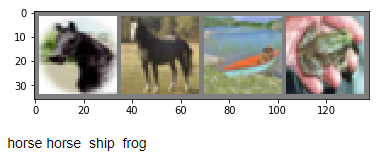

[TOC]

# 自定义卷积的卷积核参数

> 核心操作：

`torch.nn.functional.conv2d(input, weight, bias=**None**, stride=1, padding=0, dilation=1, groups=1)`

```python
import torch.nn.functional as F
import torch.autograd as autograd
from torch.autograd import Variable
#自定义kernel
kernel = [[-1, 0, 1],
          [-1, 0, 1],
          [-1, 0, 1]]
#拓展kernel，有四个维度：out_channels,in_channels,ksize,ksize
kernel = torch.FloatTensor(kernel).expand(1,3,3,3)
kernel = Variable(kernel, requires_grad = True) #将kernel转变为可以自动求导的参数，不要的话将其注释即可

#这两种效果是一样的，Variable可以为其添加是否需要进行求导的属性
inputs = Variable(torch.randn(1,3,5,5))
#inputs = torch.randn(1,3,5,5)

#求卷积操作
F.conv2d(inputs, kernel, padding=0)
```

输出
```python
tensor([[[[ 0.5170,  0.5553, -0.9835],
          [-2.5172, -1.6232,  4.6156],
          [-0.3801, -3.9086,  6.6728]]]], grad_fn=<ThnnConv2DBackward>)
```

```python
print(type(filters))
print(kernel,inputs.grad)
```
输出
```python
<class 'torch.Tensor'>
tensor([[[[-1.,  0.,  1.],
          [-1.,  0.,  1.],
          [-1.,  0.,  1.]],

         [[-1.,  0.,  1.],
          [-1.,  0.,  1.],
          [-1.,  0.,  1.]],

         [[-1.,  0.,  1.],
          [-1.,  0.,  1.],
          [-1.,  0.,  1.]]]], requires_grad=True) None
```


# [Python中的复制，深拷贝和浅拷贝](https://www.cnblogs.com/xueli/p/4952063.html)

> 最好直接对每一个变量都进行初始化，如下所示，这样一个参数变化不会影响到另一个参数：
>
> ```python
> foreground_image = torch.zeros(2,3,3,3)
> background_image = torch.zeros(2,3,3,3)
> ```

## 直接赋值,默认浅拷贝传递对象的引用而已,原始列表改变，被赋值的b也会做相同的改变

```python
alist=[1,2,3,["a","b"]]
b=alist
print(b)
alist.append(5)
print(alist,b)
```

```
[1, 2, 3, ['a', 'b']]
[1, 2, 3, ['a', 'b'], 5] [1, 2, 3, ['a', 'b'], 5]
```

## copy浅拷贝，没有拷贝子对象，所以原始数据改变，子对象会改变

```python
>>> import copy

>>> c=copy.copy(alist)
>>> print alist;print c
[1, 2, 3, ['a', 'b']]
[1, 2, 3, ['a', 'b']]
>>> alist.append(5)
>>> print alist;print c
[1, 2, 3, ['a', 'b'], 5]
[1, 2, 3, ['a', 'b']]

>>> alist[3]
['a', 'b']
>>> alist[3].append('cccc')
>>> print alist;print c
[1, 2, 3, ['a', 'b', 'cccc'], 5]
[1, 2, 3, ['a', 'b', 'cccc']] 里面的子对象被改变了
```

## 深拷贝，包含对象里面的自对象的拷贝，所以原始对象的改变不会造成深拷贝里任何子元素的改变

```python
>>> import copy

>>> d=copy.deepcopy(alist)
>>> print alist;print d
[1, 2, 3, ['a', 'b']]
[1, 2, 3, ['a', 'b']]始终没有改变
>>> alist.append(5)
>>> print alist;print d
[1, 2, 3, ['a', 'b'], 5]
[1, 2, 3, ['a', 'b']]始终没有改变
>>> alist[3]
['a', 'b']
>>> alist[3].append("ccccc")
>>> print alist;print d
[1, 2, 3, ['a', 'b', 'ccccc'], 5]
[1, 2, 3, ['a', 'b']]  始终没有改变
```


# PyTorch中Tensor的查找和筛选

[PyTorch中Tensor的查找和筛选](https://blog.csdn.net/tfcy694/article/details/85332953)

# 根据设备自动调用CUDA

```python
use_cuda = torch.cuda.is_available() #判断设备是否可以使用GPU
#如果可是使用GPU，则将模型、数据集、和标签转化为CUDA模式
if use_cuda:
    model.cuda()
#对数据的处理
for batch_idx, (data, target) in enumerate(train_loader):
        if use_cuda:
            data, target = data.cuda(), target.cuda()
        data, target = Variable(data), Variable(target)
```

# 官方数据的导入及调用

[训练一个分类器](https://pytorch.apachecn.org/docs/0.3/blitz_cifar10_tutorial.html)

```python
#导入库
import torch
import torchvision
import torchvision.transforms as transforms
#torchvision 数据集的输出是范围 [0, 1] 的 PILImage 图像. 我们将它们转换为归一化范围是[-1,1]的张量

#导入数据集CIFAR10
transform = transforms.Compose([transforms.ToTensor(),transforms.Normalize((0.5, 0.5, 0.5), (0.5, 0.5, 0.5))])
trainset = torchvision.datasets.CIFAR10(root='./data', train=True,download=True, transform
=transform)
trainloader = torch.utils.data.DataLoader(trainset, batch_size=4,shuffle=True, num_workers=2)
testset = torchvision.datasets.CIFAR10(root='./data', train=False,download=True, transform=
transform)
testloader = torch.utils.data.DataLoader(testset, batch_size=4,shuffle=False, num_workers=2)
classes = ('plane', 'car', 'bird', 'cat','deer', 'dog', 'frog', 'horse', 'ship', 'truck')

#调用数据
import matplotlib.pyplot as plt
import numpy as np
# 定义函数来显示图像
def imshow(img):
    img = img / 2 + 0.5 # 非标准化
    npimg = img.numpy()
    plt.imshow(np.transpose(npimg, (1, 2, 0)))
    plt.show()
# 得到一些随机的训练图像
dataiter = iter(trainloader)
images, labels = dataiter.next()
# 显示图像
imshow(torchvision.utils.make_grid(images))
# 输出类别
print(' '.join('%5s' % classes[labels[j]] for j in range(4)))
```



# 普通图片读取

## 使用from PIL import Image 读取图片

```python
from torchvision import transforms
from PIL import Image
import matplotlib.pyplot as plt

%matplotlib inline

img_path = "dog.jpg"
image = Image.open(img_path)#type(image)：PIL.JpegImagePlugin.JpegImageFile
img_torch = transforms.ToTensor()(image) #把一个取值范围是[0,255]的PIL.Image 转换成 Tensor，torch.Size([3, 1200, 1200])
plt.imshow(img_torch.numpy().transpose(1,2,0)) #数据类型tensor-->numpy转换，(1200, 1200, 3)
plt.show()
```


## 使用import matplotlib.image as mpimg 读取图片

```python
import matplotlib.pyplot as plt
import matplotlib.image as mpimg # mpimg 用于读取图片

# 读取图片
dog = mpimg.imread('timg.jpg')
plt.subplot(121)
plt.imshow(dog)
plt.title('Original Image')
#形状reshape，测试是否可以在变换后进行还原到原来的图像上
dog = dog.reshape(1,3,1200,1200)
dog = dog.reshape(1200,1200,3)
plt.subplot(122)
plt.imshow(dog) #(1200,1200,3)
plt.title('Original-->Reshape Image')
plt.show()
```


# shape和size的区别

## [numpy] 

### .size：计算数组和矩阵所有数据的个数 

```python
a = np.array([[1,2,3],[4,5,6]]) 
np.size(a)#返回值为 6 
np.size(a,1)#返回值为 3
a.size ##返回值为 6
```

### .shape():得到矩阵每维的大小 

```python
a = np.array([[1,2,3],[4,5,6]]) 
np.shape(a) #返回值为 (2,3)
a.shape #返回值为 (2,3)
```

>另外要注意的是，shape和size既可以作为函数，也可以作为ndarray的属性 

## [pytorch]

### .shape

```python
theta = torch.tensor([
    [1, 0, -0.2],
    [0, 1, -0.4]
], dtype=torch.float)
theta.shape #torch.Size([2, 3])
```
### .size()
```python
theta = torch.tensor([
    [1, 0, -0.2],
    [0, 1, -0.4]
], dtype=torch.float)
theta.size() #torch.Size([2, 3])
```


# pytorch中squeeze()和unsqueeze()函数介绍

## **unsqueeze()函数**：增加维度


可以看出a的维度为（2，3）

在第二维增加一个维度，使其维度变为（2，1，3）


可以看出a的维度已经变为（2，1，3）了，同样如果需要在倒数第二个维度上增加一个维度，那么使用b.unsqueeze(-2)

## **squeeze()函数介绍**：减小维度

1.首先得到一个维度为（1，2，3）的tensor（张量）


由图中可以看出c的维度为（1，2，3）

2.下面使用squeeze()函数将第一维去掉


可见，维度已经变为（2，3）

3.另外


可以看出维度并没有变化，仍然为（1，2，3），这是因为只有维度为1时才会去掉。

# 对图片进行裁剪，改变图片大小

```python
from PIL import Image
import torchvision.transforms as transforms
import matplotlib.pyplot as plt


def readImage(path, size):
    mode = Image.open(path)
    transform1 = transforms.Compose([
        transforms.Resize(size),
        transforms.CenterCrop((size, size)),
        transforms.ToTensor()
    ])
    mode = transform1(mode)
    return mode


def showTorchImage(image):
    mode = transforms.ToPILImage()(image)
    plt.imshow(mode)
    plt.show()

Example_Picture = readImage('dog.jpg',size=32)
showTorchImage(Example_Picture)
```

